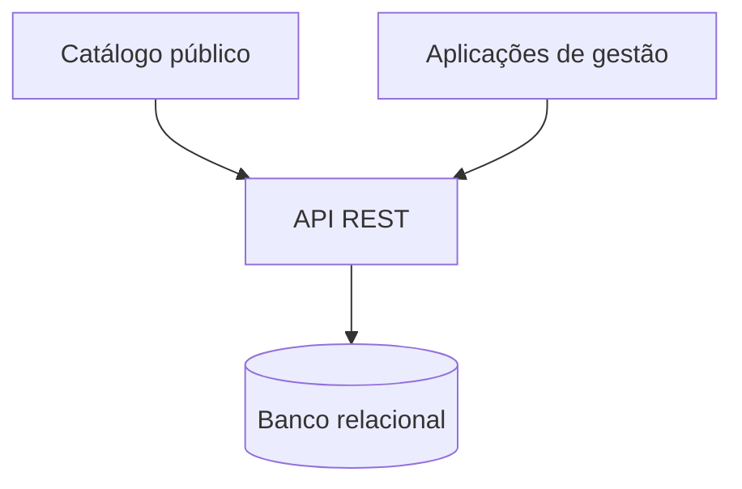

# Estudo de caso — Plataforma Uber Hidráulica Peças

> Visão pública e resumida de um sistema comercial real. O código-fonte e os detalhes operacionais permanecem privados.

## Contexto

A Uber Hidráulica Peças precisava organizar sua presença digital e apoiar a operação diária com aplicações conectadas. O projeto evoluiu de um site institucional para uma plataforma com catálogo público e ferramentas internas de gestão.

## Minha atuação

Atuação full stack desde o entendimento do problema até a manutenção em produção:

- levantamento e tradução de necessidades do negócio;
- desenvolvimento das interfaces;
- construção e consumo de APIs REST;
- modelagem e persistência de dados;
- correção de falhas e evolução de funcionalidades;
- versionamento, deploy e acompanhamento do sistema.

## Visão técnica

| Área | Tecnologias utilizadas |
|---|---|
| Frontend | React, TypeScript, Vite e Tailwind CSS |
| Backend | Node.js, Express e APIs REST |
| Dados | PostgreSQL |
| Documentação e testes de API | Swagger/OpenAPI e Postman |
| Entrega | Git, GitHub, Vercel e Render |

## Capacidades apresentadas

- Catálogo responsivo de produtos.
- Busca e organização das informações comerciais.
- Aplicações separadas conforme o tipo de usuário.
- Integração entre frontend, API e banco de dados.
- Evolução contínua de um sistema usado em contexto real.

## Decisões de projeto

### Separação das aplicações

As interfaces públicas e internas possuem objetivos e usuários diferentes. A separação permite evoluir cada experiência sem concentrar todo o sistema em uma única aplicação.

### Regras centralizadas na API

A API mantém a comunicação com o banco e concentra o comportamento compartilhado pelas interfaces, reduzindo duplicação e inconsistências.

### Código comercial privado

Os repositórios operacionais não são públicos porque representam um produto utilizado por uma empresa real. Em uma entrevista técnica, posso explicar decisões de arquitetura e desafios enfrentados sem divulgar informações estratégicas.

## O que não está exposto

Este estudo de caso não publica:

- código-fonte das aplicações internas;
- endpoints, estruturas de tabelas ou configurações;
- regras financeiras, fiscais ou comerciais;
- autenticação, permissões ou integrações internas;
- dados de clientes, fornecedores, produtos ou vendas;
- endereços das aplicações administrativas.

## Evidência pública

- [Catálogo da Uber Hidráulica Peças](https://www.uberhidraulicapecas.com.br/)
- [Perfil do desenvolvedor](https://github.com/Wendersonjose)

---

[Voltar ao perfil](../README.md)